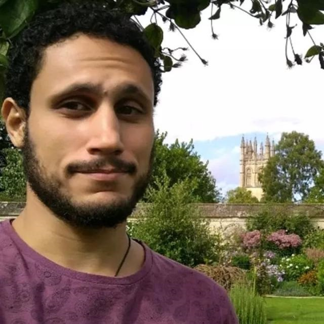
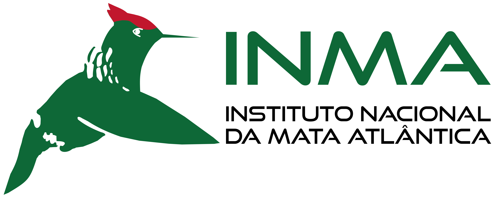

```{r}
knitr::opts_chunk$set(fig.pos = "!H", out.extra = "")
```


Evolução do impacto antrópico nas Unidades de Conservação na Mata Atlântica
=====================================
```{r setup, warning=FALSE, include=FALSE}
library(flexdashboard)
library(tidyverse)
library(knitr)
library(leaflegend)
library(leaflet)
#library(leaflet.extras)
library(shiny)
library(shinyjs)
library(highcharter)
library(DT)
library(plotly)

Dashboard_Data<-read.csv("DashboardData.csv")
```

```{r}
addMapResetButton <- function(leaf) {
  leaf %>%
    addEasyButton(
      easyButton(
        icon = "ion-arrow-shrink", 
        title = "Reset View", 
        onClick = JS(
          "function(btn, map){ map.setView(map._initialCenter, map._initialZoom); }"
        )
      )
    ) %>% 
    htmlwidgets::onRender(
      JS(
"
function(el, x){ 
  var map = this; 
  map.whenReady(function(){
    map._initialCenter = map.getCenter(); 
    map._initialZoom = map.getZoom();
  });
}"
      )
    )
}
```

```{r message=FALSE, warning=FALSE, include=FALSE}
Dashboard_Data<-Dashboard_Data%>%
              mutate(ids=UC_NAME2)%>%
  as_tibble()

MEDIA_UC_MA<-Dashboard_Data%>%
  summarise_at(vars(HFP1993: HFP2013), mean, na.rm = TRUE)%>%
  mutate(UC_NAME2="MEDIA_UC_MA")%>%
  mutate(ids="MEDIA_UC_MA")

#Add MEDIA as a new observation
Dashboard_Data<-Dashboard_Data%>%add_case(MEDIA_UC_MA)

#Check if MEDIA is here
#Dashboard_Data%>%tail(1)

Dashboard_Data_MEDIA<-Dashboard_Data%>%
filter(UC_NAME2=="MEDIA_UC_MA")%>% select(UC_NAME2,PLA_MAN2,MATA_ARE2,HFP1993:HFP2013)%>%
  pivot_longer(!c(UC_NAME2:MATA_ARE2),names_to="ANO",values_to="Impacto")%>%
  mutate(ANO=str_replace(ANO,"HFP", ""))%>%
  mutate(Impacto=round(Impacto,2))


pal_man<- colorFactor(c("tomato","royalblue2"), domain = df<-Dashboard_Data$PLA_MAN2)
df<-Dashboard_Data
```


Column {.tabset}
-----------------------------------------------------------------------


### Uso e layout

#### Uso e layout

O projeto UCFootprint é basicamente uma mapa interativo que mostra a evolução do impacto antrópico em cada Unidade de Conservação (UC) da Mata atlântica. São três componentes principais que formam o projeto: um mapa interativo onde o usuário escolhe a UC de interesse, um painel com gráfico mostrando a evolução do impacto antrópico na UC comparado com a média da Mata Atlântica e uma terceiro painel que está em braco nessa versão preliminar. Você pode conferir um panorâma do projeto UCFootprint na figura abaixo. Espero que todas as demais informações estejam intuítivas.

{width=80%}


### Mapa interativo

```{r}
output$map <- renderLeaflet({

leaflet(Dashboard_Data, width="1000px")%>%
  addTiles() %>%  # Add default OpenStreetMap map tiles
    addMiniMap()%>%
 #    addMarkers(lng = ~Long, lat = ~Lat)%>%
  addMapResetButton()%>%
addCircleMarkers(
           layerId = ~UC_NAME2, 
                 lng = ~Long, lat = ~Lat,
#                 clusterOptions = markerClusterOptions(),
                  color = ~ifelse(PLA_MAN2=="Sim","Blue","Red"),
#                       color = ~pal_man(PLA_MAN2),
             popup = ~paste0(UC_NAME2,
	"<br/><strong>Jurisprudence</strong>:",ESF_ADM2,
	"<br/><strong>Management plan.:</strong>",PLA_MAN2))
})

leafletOutput('map')  
```


### Global Human Footprint e Mata Atlântica


Uma breve explicação

#### Um pouco sobre o Global Human Footprint


Somos mais de 7 bilhões de pessoas no mundo. O impacto humano sobre os recursos naturais da terra (ex. água, minerais, florestas) é sem precedentes na história humana. Se por um lado aumenta a pressão que a humanidade exerce sobre o planeta, por outro cresce também nossa capacidade de monitorar esses impactos e propor soluções mais inovadoras para monitorar e preservar o planeta. Uma dessas iniciativas tem sido a proposta de um índice chamado de “Global Human Footprint” proposto em 2002 com dados de 1990, onde oito diferentes impactos antrópicos (ex. pastagens,luz noturna,rodovia) foram mapeados globalmente para gerar um mapa de locais mais “selvagens” e modificados do planeta. De lá pra cá, as imagens de satélite melhoraram, a precisão do tamanho do impacto aumentou, e os computadores permitiram processar cada vez mais dados. A partir da proposta do Global Human Footprint, podemos mapear como a paisagem se transformou através de múltiplos fatores. Para facilitar, Venter et al. (2016) produziu mapas globais do Global Human Footprint para os anos de 1993, 2000, 2005, 2010 e 2013 permitindo acompanhar a evolução desses impactos por 2 décadas. Outras iniciativas tem utilizado uma abordagem semelhante para produzir mapas ainda mais recentes. 


{width=450px}{width=450px}


#### A Mata atlântica e as Unidades de conservação

Uma das formas mais eficientes de garantir a sobrevivência das espécies e o bom funcionamento da Mata Atlântica tem sido a criação de Unidades de Conservação (UCs). As UCs são áreas protegidas com diferentes objetivos como a proteção da biodiversidade e proteção de córregos e nascentes, por exemplo, que podem ou não ser abertas ao público para o turismo, lazer e em alguns casos a extração de produtos florestais específicos para alimentação ou outros usos (ex. fármacos e cosméticos).

Apesar de legalmente protegidas, as UCs continuam sofrendo os impactos que persistem nas áreas ao seu redor bem como sendo alvo de atividades ilegais como a caça, a pesca, o tráfico de animais e plantas nativas, a introdução de espécies exóticas e o corte seletivo de madeira. Com recursos e pessoal limitados nas UCs do Brasil, novas tecnologias podem se tornar importantes aliados para o melhor planejamento e gestão das Unidades de conservação. Algumas iniciativas como o MapBiomas, XXXxX, YYYY são exemplos de ferramentas de fácil acesso para pesquisadores, gestores e tomadores de decisão monitorar as modificações na paisagem e quantificar seus impactos sobre as UCs. 

O *projeto UCFootprint* da Mata Atlântica surge na tentativa de fornecer uma ferramenta adicional para explorar a evolução das pressões antrópicas da Mata Atlântica. Com base no Global Human Footprint extraído de cada UC registrada na Mata Atlântica, o projeto UCFootprint fornece uma série histórica simplificada, padronizada, reproduzível e comparável em diferentes escalas para o monitoramento e fomentar o despertar de ideias que contribuir para a conservação da Mata Atlântica.


#### Críticas
Em breve


#### Futuro
Em breve

Column {data-width=350, height=450}
-----------------------------------------------------------------------

### Evolução do impacto antrópico - 1993 a 2013


```{r}

#click_marker <- eventReactive(input$map_marker_click, {
click_marker <- eventReactive(input$map_marker_click, {
     x<-input$map_marker_click
       if(is.null(input$map_marker_click)){
       return(input$reset) 
    }else{
        return(x$id)
      }
})


#Funciona
data_for_chart <- reactive({
  return(df[df$UC_NAME2 == click_marker(), ])
})


renderPlotly({
    data_for_chart2<-data_for_chart()%>%
  as_tibble()%>%
  select(UC_NAME2,PLA_MAN2,MATA_ARE2,HFP1993:HFP2013)%>%
  pivot_longer(!c(UC_NAME2:MATA_ARE2),names_to="ANO",values_to="Impacto")%>%
  mutate(ANO=str_replace(ANO,"HFP", ""))%>%
    mutate(Impacto=round(Impacto,2))
  Dashboard_Data_MEDIA%>%
  plotly::plot_ly(.,
        x = .$ANO,
          y = .$Impacto,
          type = "scatter",
          mode = 'lines+markers',name="Mata Atlântica")%>%
    add_trace(data_for_chart2, 
	x = data_for_chart2$ANO, 
		y = data_for_chart2$Impacto, mode = "lines+markers",name=data_for_chart2$UC_NAME2) %>%
  layout(hovermode = "x unified",
    #title ="Evolução do impacto antrópico",
         yaxis = list(title = "Impacto Antrópico",range = c(0,55)),
    showlegend = T, 
    legend = list(orientation = 'h')
  )

})

```


### Chart C

Mais informações serão adicionadas aqui em breve


Sobre {data-orientation=rows}
=====================================


Column {.tabset}
-----------------------------------------------------------------------

### Sobre
Seja bem-vindo(a) ao projeto "UCFootprint: Evolução do impacto antrópico nas Unidades de Conservação da Mata Atlântica. O projeto está sendo desenvolvido pelo pesquisador Gabriel Santos como parte do plano de trabalho sob financiamento do Projeto de Capacitação Institucional Nº3: "Diagnóstico das unidades de conservação e espécies ameaçadas de extinção na Mata Atlântica brasileira" do Instituto Nacional da Mata Atlântica.

O projeto encontra-se em fase inicial de desenvolvimento mas já permite ter uma visão sobre o como a versão final do aplicativo deve ser. 


Caso tenha interesse em contribuir com ideias ou diretamente com o aplicativo sinta-se a vontade para entrar em contato.


#### Gabriel Silva dos Santos

Gabriel S. Santos é pesquisador do Instituto Nacional da Mata Atlântica [(INMA)](http://inma.gov.br/).

Para entrar em contato basta [Entre em contato](mailto:ssantos.gabriel@gmail.com)

{width=20%}


#### Parceiro
{width=40%}


